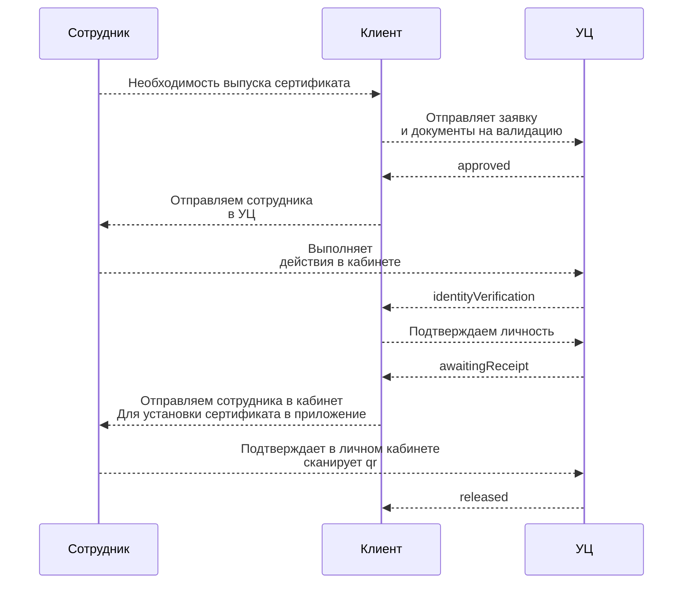
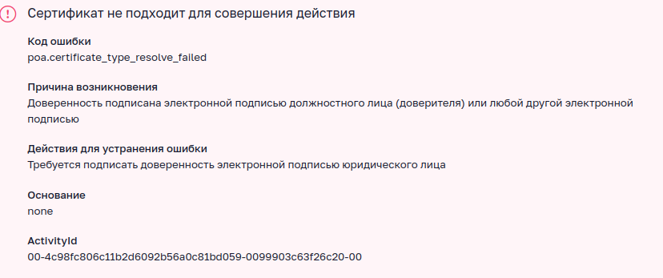

# [Тестовое контур](Тестовое_задание_на_специалиста_по_внедрению_УЦ.docx)

## Теоретическая часть

### 1 

Необходимо определить, какие подписи будут использоваться — квалифицированные, неквалифицированные или оба вида. Это позволит сформировать соответствующие требования к системе хранения персональных данных.

В системе учёта пользователей. Для обеспечения безопасности и соответствия законодательству, система должна хранить следующие реквизиты пользователя:

- ФИО
- адрес электронной почты
- номер телефона
- другие данные, необходимые для идентификации пользователя.
- Сканы документов, подтверждающих личность пользователя (паспорт, СНИЛС и т. д.).
- Активные сертификаты и Выданные МЧД и их актуальность.


Для выдачи сертификатов на стороне клиента необходимо подключить КЦР.
Назначить сотрудника, ответственного за валидацию (проверку подлинности) и сбор данных. Этот сотрудник будет отвечать за обеспечение точности и актуальности информации в системе и передавать документы в УЦ.

Для выдачи машиночитаемых доверенностей (МЧД) необходимо определить роли пользователей в организации: Создать передоверяемые доверенности для администратора с возможностью выдачи сотрудникам в зависимости от их ролей. Выдачу МЧД можно осуществлять через API Контур.Доверенность.

Для внешнего документооборота и работы с формализованными документами рекомендуется использовать API Диадок. Для внутреннего документооборота можно использовать облачные сервисы через CryptoApi и специализированное приложение.

Система электронного документооборота клиента должна работать через защищённый канал связи, обеспечивать мониторинг очередей событий и соответствовать требованиям законодательства к безопасности.


### 2

Подписать документ можно, но всё зависит от различных факторов. Например, усовершенствованная ли это подпись и успеет ли оператор ЭДО за этот промежуток времени актуализировать данные об отзыве сертификата. В любом случае юридической значимости такой документ иметь не должен.

Возможна ситуация, когда подписание документа происходит без оператора ЭДО (например, по электронной почте) и без использования усовершенствованной подписи. Тогда нет возможности проверить точное время подписания документа. В таком случае ответственность ложится на того, кто вносит документы в свою учётную систему.

### 3
- ПЕП Не обеспечивает неизменность документа используется для обеспечения безопасности в транзакциях
- НЕП Получается через уц может использоваться для подписания документов но юридическую значимость они будут иметь только при дополнительных соглашениях между контрагентами
- КЭП Можно использовать для подписания юридически значимых документов 

## Практическая часть


### 1
Пример работы с апи 



Создаёт заявку пользователя и передаёт на валидацию УЦ
```
docker run --rm -v ./app:/app node:latest /app/start create
```

#### Заявление на выпуск прилагается. Сотруднику в кабинете нужно выбрать способ подтверждения. Встаёт на шаге "Подтвердите личность"

Подтверждает личность в статусе identityVerification
```
docker run --rm -v ./app:/app node:latest /app/start checkIdentify
```

Создаёт и отправляет тестовый документ на подпись 
```
docker run --rm -v ./app:/app node:latest /app/start sign
```
### Дополнительно 
- При изменении паспортных данных заявка отклоняется correction "По данным МВД паспорт недействителен"
- Для проверки тлс канала 

```
docker run --rm -v ./app:/app node:latest /app/start hello
```

### 2

- При загрузке МЧД подписанной тестовой 


- [МЧД](/app/testmhd.xml)
- [Подпись](/app/signature.der.sig)


