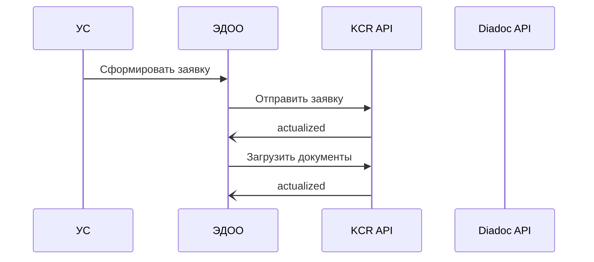

# Тестовое контур

## Теоретическая часть

### Система учёта сотрудников (УС)
1. Защищённое хранение персональных данных сотрудников
2. Права и роли  
3. Хранение информации о ЭП/МЧД
4. Формирование заявок выпуск/перевыпуск/отзыв ЭП/МЧД
5. Хранение данных и удостоверяющих документов необходимых для выпуска ЭП 

### Система ЭДО организации (ЭДОО)
1. Пул заявок на выпуск/перевыпуск/отзыв ЭП (KCR API)
2. Пул заявок на выпуск/отзыв выпуск МЧД (KCR API)
3. Добавление сотрудника/удаление сотрудника в организацию (Diadoc API)  
4. Очередь на подпись документов в случае НЕП/ПЕП/DSS (Crypto API)
6. Хранение КЭП лица уполномоченного подписывать заявки либо интерфейс 

#### Сценарии

Выпуск КЭП

## Практическая часть

