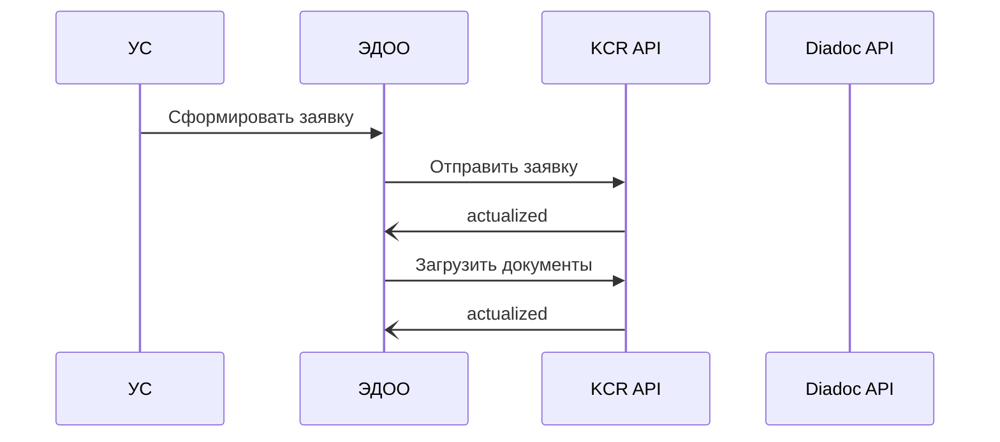

# Тестовое контур

## Теоретическая часть

### Система учёта сотрудников (УС)
1. Защищённое хранение персональных данных сотрудников
2. Права и роли  
3. Хранение информации о ЭП/МЧД
4. Формирование заявок выпуск/перевыпуск/отзыв ЭП/МЧД
5. Хранение данных и удостоверяющих документов необходимых для выпуска ЭП 

### Система ЭДО организации (ЭДОО)
1. Пул заявок на выпуск/перевыпуск/отзыв ЭП (KCR API)
2. Пул заявок на выпуск/отзыв выпуск МЧД (KCR API)
3. Добавление сотрудника/удаление сотрудника в организацию (Diadoc API)  
4. Очередь на подпись документов в случае НЕП/ПЕП/DSS (Crypto API)
6. Хранение КЭП лица уполномоченного подписывать заявки либо интерфейс 

Необходимо выяснить как именно подписи собираются использовать квалифицированные неквалифицированные или и те и другие. На основании этого сформировать требования к системе хранения персональных данных. Какие реквизиты пользователя нужны сканы документов. Предложить клиенту использовать для внешнего документооборота и формализованных документов использовать апи диадока. Для внутреннего можно использовать облачные НЕПы через CryptoApi. Система ЭДО клиента должна работать через защищённый канал. Обеспечивать мониторинг очередей событий. 

#### Сценарии

Выпуск КЭП

## Практическая часть

https://itest.kontur-ca.ru/Wizard/Run?formId=2de5fe8a-85fe-4a2b-9cab-1494453de935
http://46.17.202.75:5555/api/testsms?phone=79122694997

Например, их можно хранить в распределенном реестре ФНС — самом большом хранилище МЧД. Но не все информационные системы, которые принимают МЧД, работают с этим реестром 一 например, системы отчетности ФНС, СФР и портал Госзакупок. 