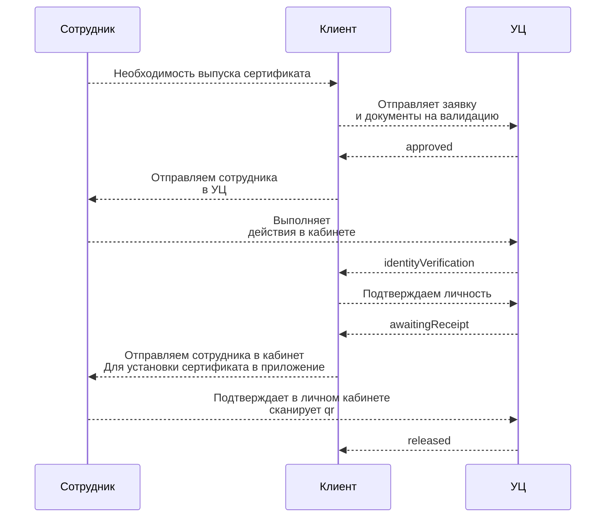

## Теоретическая часть

### 1

Для выдачи сертификатов внутри организации рекомендуется использовать КЦР.
Для выдачи машиночитаемых доверенностей (МЧД) необходимо определить роли пользователей в организации: Создать передоверяемые доверенности для администратора с возможностью выдачи сотрудникам в зависимости от их ролей. Выдачу МЧД можно осуществлять через API Контур.Доверенность.

Для внешнего документооборота и работы с формализованными документами рекомендуется использовать API Диадок. Для внутреннего документооборота можно использовать облачные сервисы через CryptoApi и специализированное приложение.


### Со стороны клиента
Необходимо определить, какие подписи будут использоваться — квалифицированные, неквалифицированные или оба вида. Это позволит сформировать соответствующие требования к системе хранения персональных данных.
Для выдачи сертификатов на стороне клиента необходимо подключить КЦР.
Назначить сотрудника, ответственного за валидацию и сбор данных. Этот сотрудник будет отвечать за обеспечение точности и актуальности информации в системе и передавать документы в УЦ. Реализовать взаимодействие с АПИ Контура и интегрировать во внутренние процессы и сервисы организации.


### Со стороны контура
Проанализировать процессы в которых планируется использование электронного документооборота. Провести аудит его информационных систем со стороны документооборота и возможностей интеграции с Контуром. 
Обучение и помощь сотруднику организации в работе с КЦР. Помощь в интеграции АПИ.
Обеспечить поддержку взаимодействия с сервисами Контура. 

### 2

Подписать документ можно, но всё зависит от различных факторов. Например, усовершенствованная ли это подпись и успеет ли оператор ЭДО за этот промежуток времени актуализировать данные об отзыве сертификата. В любом случае юридической значимости такой документ иметь не должен.

Возможна ситуация, когда подписание документа происходит без оператора ЭДО (например, по электронной почте) и без использования усовершенствованной подписи. Тогда нет возможности проверить точное время подписания документа. В таком случае ответственность ложится на того, кто вносит документы в свою учётную систему. И оспаривается согласно законодательству.


## Практическая часть


### 1
Пример работы с апи 



Создаёт заявку пользователя и передаёт на валидацию УЦ
```
docker run --rm -v ./app:/app node:latest /app/start create
```

#### Заявление на выпуск прилагается. Сотруднику в кабинете нужно выбрать способ подтверждения. Встаёт на шаге "Подтвердите личность"

Подтверждает личность в статусе identityVerification
```
docker run --rm -v ./app:/app node:latest /app/start checkIdentify
```

Создаёт и отправляет тестовый документ на подпись 
```
docker run --rm -v ./app:/app node:latest /app/start sign
```
